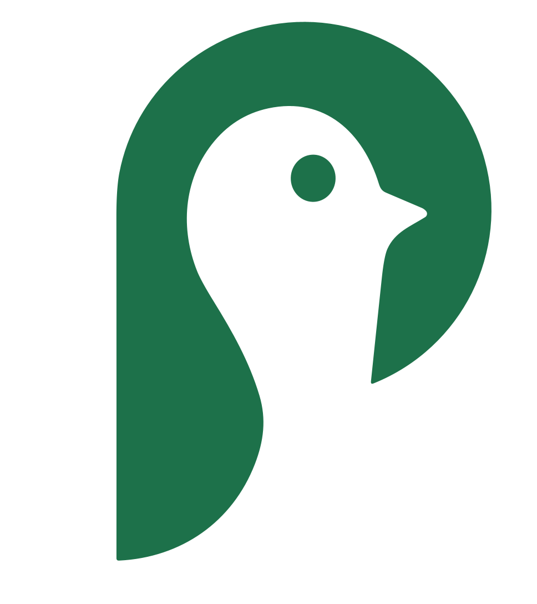

<h1 align="center">
  <br>
  </a>
  <br>
  <b>Pingo</b>
  <br>
</h1>

<!--
TODO: Fix the following hyperlinks:
-->
<p align="center">
  <a href="#about">About</a> |
  <a href="#development">Development</a> |
  <a href="#getting-started">Getting Started</a>
</p>

# About

Pingo takes the timeless classic Bingo and brings it to the the modern world with the interactivity and engagement of social media. 
Each day, users get a unique bingo card, with each tile corresponding to a randomly generated picture prompt.
In order to win for the day, you must complete 3 prompts in a row - but you may keep playing and try to clear the entire board!

Our mission at Pingo is to foster healthy friendships and positive community involvement.
We have carefully hand-picked the prompts displayed so that our users will engage in diverse experiences and activities that will have a positive impact on our users and those around them.
Aditionally, users can add their friends on the app to see their Pingo boards too, allowing for healthy competition and a way for users to see what others are up to.

# Development

Pingo was created as the final project for UCLA's COM SCI 35L course by students Pranav Sankar, Nishant Ray, Akshat Tirumalai, Krish Patel, Rishauv Kar-Roy (Discussion 1A). 
The front-end of this mobile app was built using React Native, and the backend is powered by Node.js.

# Getting Started

## Mandatory Pre-Requisites
1. Ensure your mobile device and server are connected to the same LAN.
2. Ensure you have Expo Go installed on your mobile device.
## Backend Server Setup

1. Run the Shell Script `localip_mac` to quickly access your local network IP address for Mac OS Users, or run the PowerShell Script `localip_windows.ps1` for Windows users.

2. Once the local network IP Address is obtained, go to the `pingo-backend/src/serverConfig.js` file and replace the variable called `localIPAddress` with your server's local IP address from running the earlier script.
    - If you would like Node.js to automatically assign an available port for your server to listen on, please set `portNum = 0`.

3. Then, create a .env file in the `pingo-frontend` directory (path would be `pingo-frontend/.env`), and create an environment variable called `EXPO_PUBLIC_BACKEND_SERVER`, and set it to the same IP address that you retrieved earlier. For example, if my IP address is 192.168.1.01 and I'm using port 8080, then my `pingo-frontend/.env` would look like the following:
```
EXPO_PUBLIC_BACKEND_SERVER=http://192.168.1.01:8080
```

## Launching Pingo
1. You'll need two terminals / command-line interfaces to simulate the server and client experience.
2. In one terminal, navigate your working directory to `pingo-backend`, and run the following commands:
```
npm install
npm start
```

2. In the other terminal, navigate your working directory to `pingo-frontend`, and run the following commands:
```
npm install
npm start
```
If you're on iOS, use the camera app to scan the QR code generated in your terminal to open the project via Expo Go. If you're on Android, open the Expo Go app and scan the QR code to open the project.

Note: If this last step doesn't work, try running the Expo Project with `npm run tunnel` instead of `npm start`. Be sure that you're phone and computer are on the same Wifi network and LAN.
